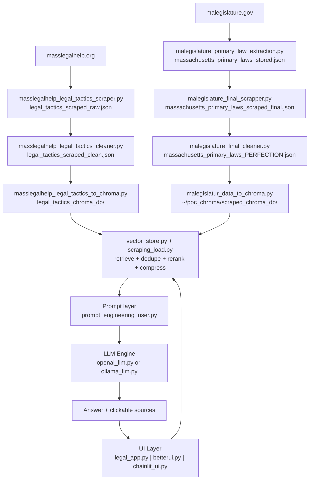

# BU Spark Legal Chatbot - Detailed System Design and Operations README

This document is the full onboarding and continuity guide for this project.

What this README covers:
- system design from first principles,
- what each scraper and processor produces,
- full setup requirements,
- exact run commands in correct sequence,
- how retrieval and answer generation works internally,
- how to validate correctness after setup,
- how to continue development safely as a new team.

---

## 1) Project Purpose and Scope

`Star` is a Massachusetts housing-law assistant built with a two-source RAG pipeline.

Primary legal sources:
- Massachusetts General Laws (`malegislature.gov`) - statutory law
- Legal Tactics (`masslegalhelp.org`) - practical legal guidance

Main behavior goals:
- answer in plain language,
- adapt perspective for `general`, `tenant`, or `landlord`,
- cite source sections with direct URLs,
- stay grounded in retrieved legal documents.

Non-goals:
- giving personalized legal advice,
- answering outside Massachusetts housing law scope,
- replacing licensed legal counsel.

---

## 2) Architecture from Basics

Think of the system as 4 connected stages:

1. **Acquisition**
   - Scrapers pull section-level legal text and URLs.
2. **Normalization**
   - Cleaners remove noise and keep only useful legal content.
3. **Indexing**
   - Clean text is embedded and persisted in Chroma vector stores.
4. **Serving (RAG)**
   - UI receives user query -> retrieval -> rerank -> compress -> LLM response -> cited answer.

Conceptual flow:

`Web pages -> Raw JSON -> Clean JSON -> Embeddings -> Chroma DBs -> Retriever + Reranker -> Prompt -> LLM -> Answer + Sources`

## Architecture Diagram



---

## 3) Directory-Level Responsibilities

### A) Runtime app layer

- `legal_app.py`  
  Gradio UI (default quick run).
- `betterui.py`  
  Streamlit UI, same backend query path.
- `chainlit_ui.py`  
  Chainlit UI with optional session PDF ingestion and OCR fallback.

### B) Core RAG backend

- `vector_store.py`  
  Loads Chroma DBs, retrieves from both sources, applies reranking/compression, calls LLM.
- `scraping_load.py`  
  Candidate retrieval strategy, deduplication, reranker logic, source formatting.
- `prompt_engineering_user.py`  
  Role-aware system prompts and structure constraints.
- `openai_llm.py`, `ollama_llm.py`, `llm_interface.py`  
  Model abstraction and provider-specific generation.
- `config.py`  
  Runtime constants for model selection, retrieval counts, thresholding, chunk controls, and paths.

### C) Legal Tactics ingestion pipeline

- `masslegalhelp_legal_tactics_scraper.py` -> `legal_tactics_scraped_raw.json`
- `masslegalhelp_legal_tactics_cleaner.py` -> `legal_tactics_scraped_clean.json`
- `masslegalhelp_legal_tactics_to_chroma.py` -> `legal_tactics_chroma_db/`

### D) Massachusetts laws ingestion pipeline

- `malegislature_primary_law_extraction.py` -> `massachusetts_primary_laws_stored.json`
- `malegislature_final_scrapper.py` -> `massachusetts_primary_laws_scraped_final.json`
- `malegislature_final_cleaner.py` -> `massachusetts_primary_laws_PERFECTION.json`
- `malegislatur_data_to_chroma.py` -> `~/poc_chroma/scraped_chroma_db/`

---

## 4) Data Contracts (What Each Stage Expects)

These contracts are important for maintainability.

### Scraped section JSON contract

Every section record should contain:
- `section_name` (string)
- `section_url` (string, direct source URL)
- `section_text` (string, usable text content)

### Vector document metadata contract

When converting to Chroma documents, include:
- `section_name`
- `section_url`
- `source`

Why this matters:
- citations depend on metadata consistency,
- retrieval debugging is easier with stable keys,
- future pipelines can merge more sources if they honor this schema.

---

## 5) Prerequisites and Installation

## OS and Tooling

- Python `3.10+` (recommended `3.11`)
- Google Chrome installed
- ChromeDriver installed and available in PATH (required by Selenium scripts)
- `make` command available (for provided Makefile shortcuts)
- internet connectivity for scraping and API/model calls

## Python environment setup

From project folder:

```bash
python3 -m venv .venv
source .venv/bin/activate
python -m pip install --upgrade pip
pip install -r requirements.txt
```

If you do not use virtualenv, install system-wide at your own risk.

## Environment variables

Create `.env` in this folder:

```env
OPENAI_API_KEY=your_openai_api_key_here
```

Required for:
- OpenAI embeddings (`*_to_chroma.py` scripts),
- OpenAI model usage in runtime,
- OCR fallback in `chainlit_ui.py`.

Optional provider:
- Ollama can be used by changing `DEFAULT_LLM` in `config.py` and running a local model.

---

## 6) Important Path and Storage Behavior

`config.py` uses two different persistence locations:

- `LEGAL_TACTICS_SCRAPED_DB_DIR` -> `legal_tactics_chroma_db` (inside current project)
- `SCRAPED_VECTOR_DB_DIR` -> `~/poc_chroma/scraped_chroma_db` (home directory)

Operational implication:
- deleting this project folder does **not** automatically remove the MA laws DB in home directory.
- if queries behave strangely after schema changes, rebuild both DBs from scratch.

---

## 7) Day-0 Full Fresh Build (Start to End)

Run from this project folder:

## Step 1 - Install dependencies

```bash
make setup
```

## Step 2 - Build all datasets and vector stores

```bash
make ingest-all
```

This runs both ingestion pipelines in correct sequence.

## Step 3 - Launch UI

Choose one:

```bash
make run-gradio
```

```bash
make run-streamlit
```

```bash
make run-chainlit
```

---

## 8) Manual Run Order (If You Need Script-by-Script Control)

Use manual mode when debugging any single stage.

### A) Legal Tactics pipeline

1) Scrape:
```bash
python masslegalhelp_legal_tactics_scraper.py
```
Produces: `legal_tactics_scraped_raw.json`

2) Clean:
```bash
python masslegalhelp_legal_tactics_cleaner.py
```
Produces: `legal_tactics_scraped_clean.json`

3) Build vectors:
```bash
python masslegalhelp_legal_tactics_to_chroma.py
```
Produces: `legal_tactics_chroma_db/`

### B) Massachusetts laws pipeline

1) Extract section links/base text:
```bash
python malegislature_primary_law_extraction.py
```
Produces: `massachusetts_primary_laws_stored.json`

2) Section-level scraping:
```bash
python malegislature_final_scrapper.py
```
Produces: `massachusetts_primary_laws_scraped_final.json`

3) Final cleaning:
```bash
python malegislature_final_cleaner.py
```
Produces: `massachusetts_primary_laws_PERFECTION.json`

4) Build vectors:
```bash
python malegislatur_data_to_chroma.py
```
Produces: `~/poc_chroma/scraped_chroma_db/`

---

## 9) Runtime Query Lifecycle (Detailed)

When user submits a question:

1. UI layer (`legal_app.py`, `betterui.py`, or `chainlit_ui.py`) captures:
   - message text,
   - selected role (`general`, `tenant`, `landlord`),
   - short conversation history.

2. `vector_store.query_vector_store()` is invoked.

3. Candidate retrieval:
   - Legal Tactics candidates from `doc_db` using MMR.
   - MA law candidates from `scraped_db` using MMR.

4. Deduplication + optional role balancing:
   - remove near-duplicate chunks,
   - preserve role-relevant content where applicable.

5. Cross-encoder rerank (`sentence-transformers`):
   - model: `cross-encoder/ms-marco-MiniLM-L-6-v2`
   - score each chunk vs query.

6. Score thresholding:
   - remove weak candidates based on `RERANK_MIN_SCORE`,
   - maintain minimum coverage constraints where configured.

7. Chunk compression:
   - long chunks are sentence-compressed around query overlap.

8. Prompt assembly:
   - context + role + user query passed to prompt template.

9. LLM response generation:
   - OpenAI by default (configurable),
   - fallback handling for runtime exceptions.

10. Citation formatting:
   - source block shown in UI as clickable links.

---

## 10) How to See and Verify the App

### Gradio

Run:
```bash
python legal_app.py
```

Open URL printed in terminal (usually local host URL bound to `0.0.0.0`).

### Streamlit

Run:
```bash
streamlit run betterui.py
```

Open printed local URL (commonly `http://localhost:8501`).

### Chainlit

Run:
```bash
chainlit run chainlit_ui.py
```

Open printed URL (commonly `http://localhost:8000`).

---

## 11) Verification Playbook (Post-Setup Acceptance Checks)

Run:

```bash
make verify-data
```

Then manually validate:

1. App starts without `Vector store not loaded` error.
2. Ask: `What rights do tenants have in Massachusetts?`
3. Confirm answer returns `Sources` section.
4. Click one citation to ensure URL opens correctly.
5. Switch role to `tenant` and ask same question.
6. Switch role to `landlord` and ask same question.
7. Confirm perspective changes while citations remain relevant.

Recommended regression prompts:
- `Can a landlord keep a security deposit?`
- `What notice is required before eviction?`
- `What should I document before going to housing court?`

---

## 12) Configuration Tuning Guide

Main tuning is in `config.py`.

### Retrieval depth

- `LEGAL_TACTICS_K`, `SCRAPED_LAW_K`: top results per source before merging.
- `LEGAL_TACTICS_FETCH_K`, `SCRAPED_LAW_FETCH_K`: candidate pool size before MMR pruning.

### Final context size

- `FINAL_CONTEXT_K`: final chunks sent to LLM after rerank/threshold.

### Reranker controls

- `USE_RERANKER`: enable/disable cross-encoder rerank.
- `RERANK_MIN_SCORE`: drop low-scoring chunks.

### Chunking/compression

- `CHUNK_SIZE`, `CHUNK_OVERLAP`: index-time chunk strategy.
- `DOC_COMPRESSION_MAX_SENTENCES`: runtime compression aggressiveness.
- `DOC_COMPRESSION_MIN_CHARS`: minimum chunk length before compression.

Change management recommendation:
- tune one parameter at a time,
- re-run a fixed prompt suite,
- log observed quality changes.

---

## 13) Troubleshooting Guide

### `OPENAI_API_KEY not found`

- Ensure `.env` is in this project folder.
- Ensure variable is named exactly `OPENAI_API_KEY`.
- Re-open shell after editing environment if needed.

### Selenium launch failures

- Confirm Chrome is installed.
- Confirm ChromeDriver version matches installed Chrome.
- Confirm `chromedriver` command resolves in terminal.

### Vector store load failure

- Ensure both vector DB paths exist.
- Re-run:
  - `python masslegalhelp_legal_tactics_to_chroma.py`
  - `python malegislatur_data_to_chroma.py`

### First query is very slow

- expected on cold start due to reranker model load.
- subsequent queries should be faster.

### Chainlit PDF OCR not working

- install `pypdfium2`,
- verify OpenAI key and API access,
- test with a smaller PDF first.

---

## 14) Team Handoff SOP (New Team Continuation)

When a new engineer joins:

1. Clone project and read this README fully.
2. Run `make setup`, then `make ingest-all`.
3. Run `make run-gradio` and complete verification checklist.
4. Review `config.py` and `prompt_engineering_user.py`.
5. Review both scraper pipelines to understand source assumptions.

Before any major change:
- write down expected effect (retrieval quality, latency, citation quality),
- keep one baseline prompt set for A/B comparison.

Before merge:
- run full ingestion once,
- run at least 8-10 representative legal prompts,
- verify no citation formatting regression,
- document changed parameters and rationale.

---

## 15) Routine Operating Commands

After initial ingestion, daily startup is usually:

```bash
make run-gradio
```

If legal content changes upstream and you need refresh:

```bash
make ingest-all
```

If only one source changed:

```bash
make ingest-legal-tactics
```

or

```bash
make ingest-malegislature
```

---

## 16) Security and Compliance Notes

- Do not commit `.env` to version control.
- Treat uploaded user documents in Chainlit as sensitive.
- Avoid logging full user-provided legal documents in plaintext logs.
- Remember all outputs must include legal-information framing, not legal advice.

---

## 17) Quickstart (Shortest Path)

For experienced devs:

```bash
make setup
make ingest-all
make run-gradio
```

Then open the URL printed by Gradio and test one question.

